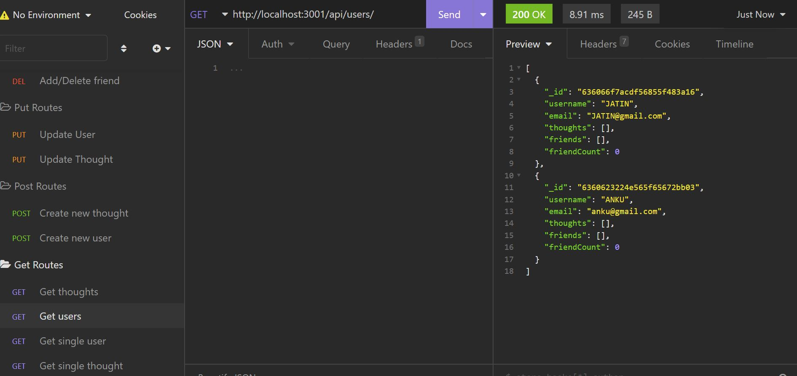

# Social-Networking

Complete Back-end for a social-networking application

## Description
* A Back end application using NoSQL database to handle unstructed data.
* In this Social API, we can add different users; who can make a friend list to add another user or can also remove the friend from the list. 
* A user can create a thought and other users can add reactions to that thought. 
* Deleting a user from the API will also delete the thought created by that user.

## Table of Contents
* [Installation](#installation)
* [Contribution](#contribution)
* [Features](#features)
* [Questions](#questions)
* [Screenshot](#screenshot)
* [Walkthrough Link](#walkthrough-link)
* [Deployed Site](#deployed-site)

## Installation
You can clone the repo into your local machine and do npm i.
Please download the following packages:
"express": "^4.18.2",
"mongoose": "^6.7.0"

## Contribution

jatin1211: https://github.com/jatin1211

## Features
* Node.js
* Capture user input
* Gitignore file
* MongoDB
* Mongoose

## Questions?
Please email me with questions!
* sainijatin247@gmail.com

## Screenshot

## Walkthrough link
PART 1:  https://drive.google.com/file/d/1pkNJ3xkdJDbTtSXFvG4kv38mazQebLTI/view  
PART 2:  https://drive.google.com/file/d/1cAPPLwSiMSBh1Ol0jlXtvczLG5X81Gs-/view

